# Examples

<table>
    <thead>
        <tr>
            <th>Example</th>
            <th>Measurement</th>
            <th>Image</th>
        </tr>
    </thead>
    <tbody>
        <!-- billow -->
        <tr>
            <td rowspan=4>billow</td>
            <td>1D</td>
            <td></td>
        </tr>
        <tr>
            <td>2D</td>
            <td>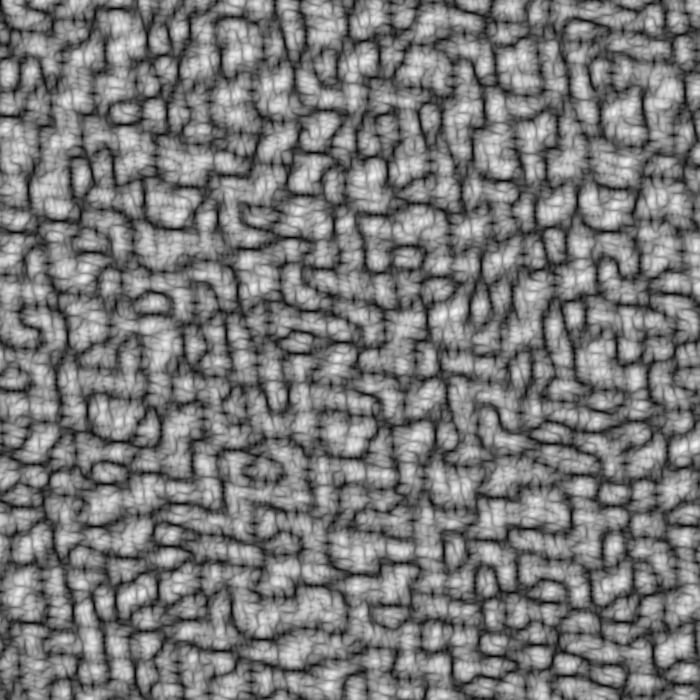</td>
        </tr>
        <tr>
            <td>3D</td>
            <td>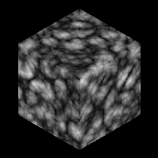</td>
        </tr>
        <tr>
            <td>4D</td>
            <td>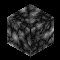</td>
        </tr>
        <!-- chaining -->
        <tr>
            <td>chaining</td>
            <td>2D</td>
            <td>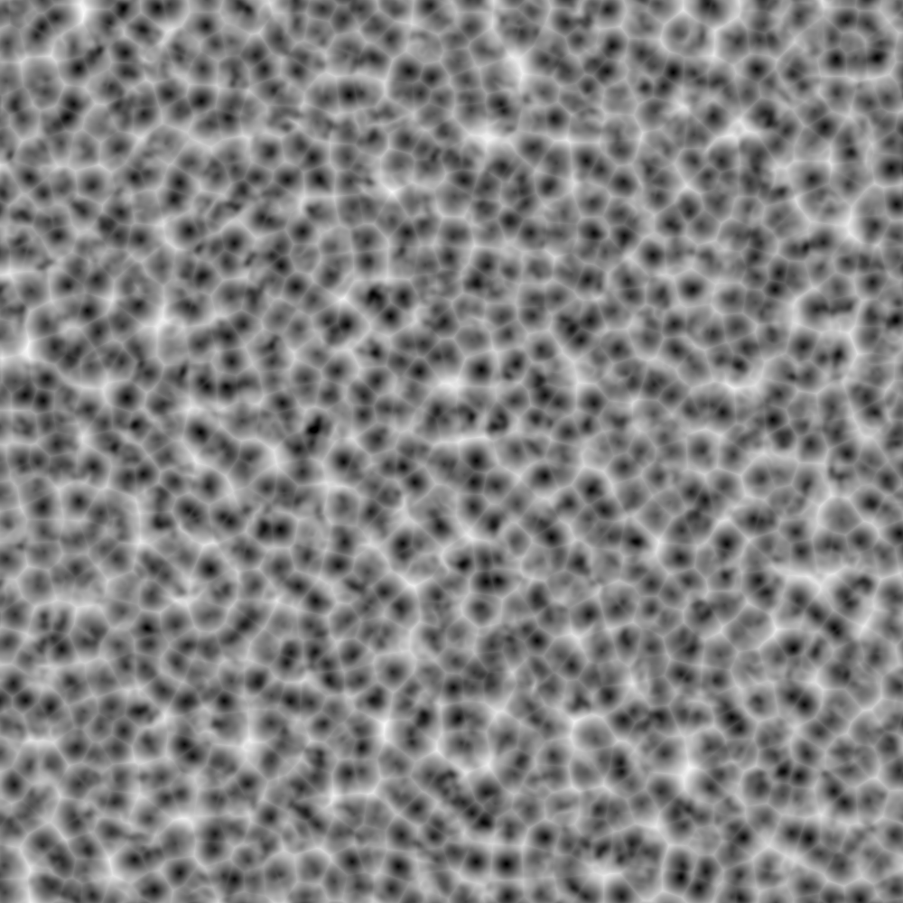</td>
        </tr>
        <!-- checkerboard -->
        <tr>
            <td rowspan=4>checkerboard</td>
            <td>1D</td>
            <td></td>
        </tr>
        <tr>
            <td>2D</td>
            <td>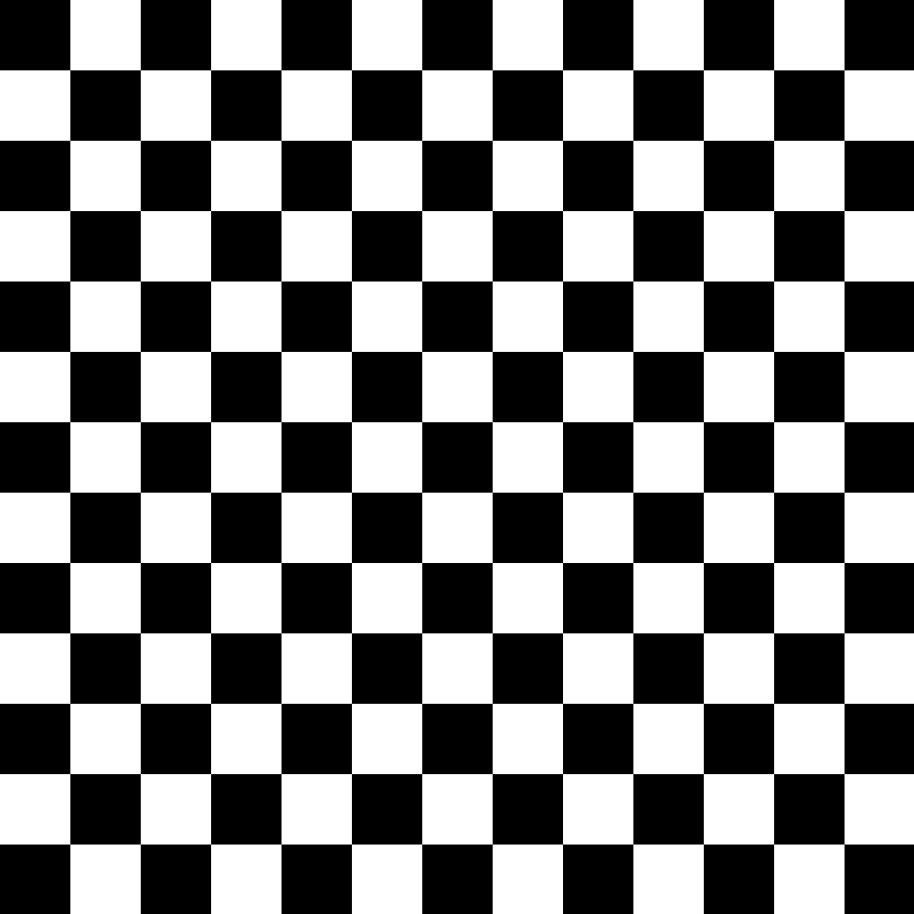</td>
        </tr>
        <tr>
            <td>3D</td>
            <td></td>
        </tr>
        <tr>
            <td>4D</td>
            <td></td>
        </tr>
        <!-- custom -->
        <tr>
            <td rowspan=4>custom</td>
            <td>1D</td>
            <td></td>
        </tr>
        <tr>
            <td>2D</td>
            <td></td>
        </tr>
        <tr>
            <td>3D</td>
            <td></td>
        </tr>
        <tr>
            <td>4D</td>
            <td></td>
        </tr>
        <!-- fbm -->
        <tr>
            <td rowspan=4>fbm</td>
            <td>1D</td>
            <td></td>
        </tr>
        <tr>
            <td>2D</td>
            <td>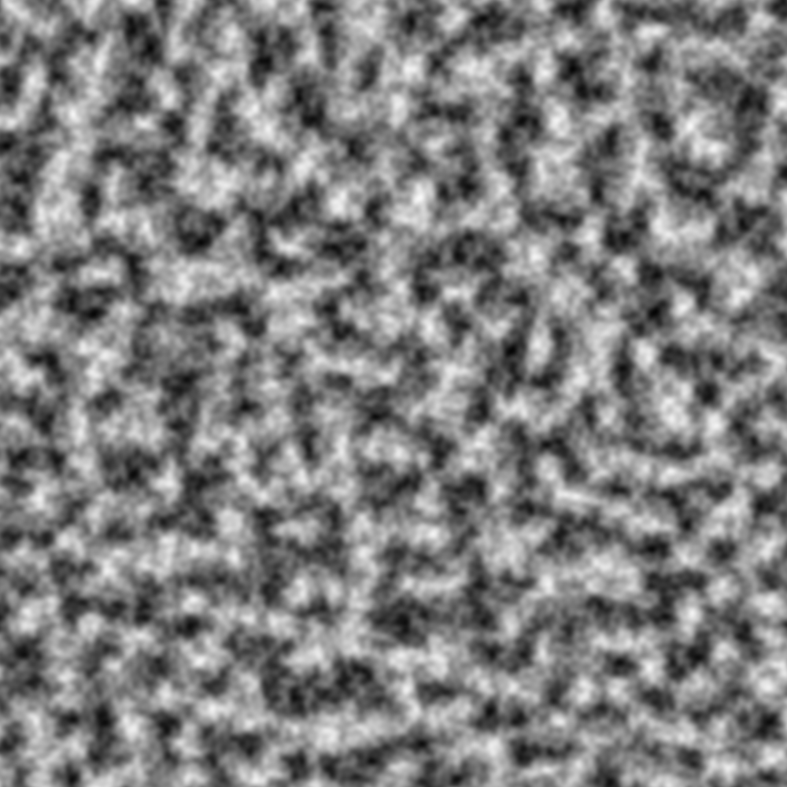</td>
        </tr>
        <tr>
            <td>3D</td>
            <td>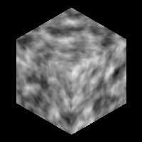</td>
        </tr>
        <tr>
            <td>4D</td>
            <td>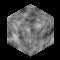</td>
        </tr>
        <!-- improved_perlin -->
        <tr>
            <td rowspan=4>improved_perlin</td>
            <td>1D</td>
            <td></td>
        </tr>
        <tr>
            <td>2D</td>
            <td>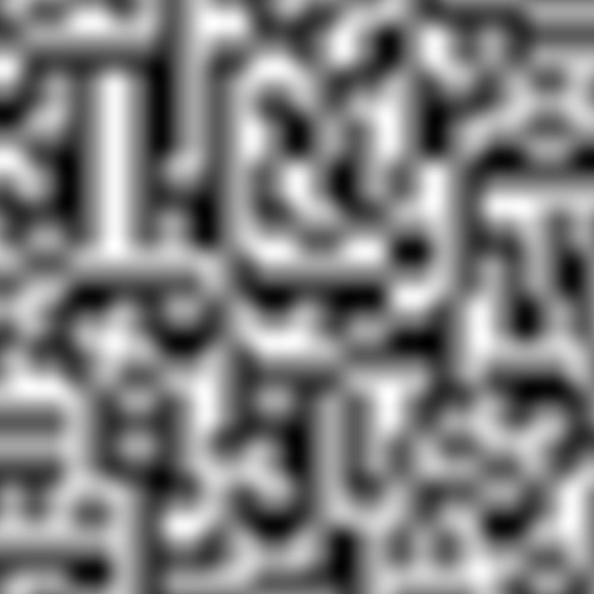</td>
        </tr>
        <tr>
            <td>3D</td>
            <td>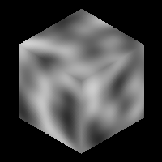</td>
        </tr>
        <tr>
            <td>4D</td>
            <td></td>
        </tr>
        <!-- perlin -->
        <tr>
            <td rowspan=4>perlin</td>
            <td>1D</td>
            <td></td>
        </tr>
        <tr>
            <td>2D</td>
            <td>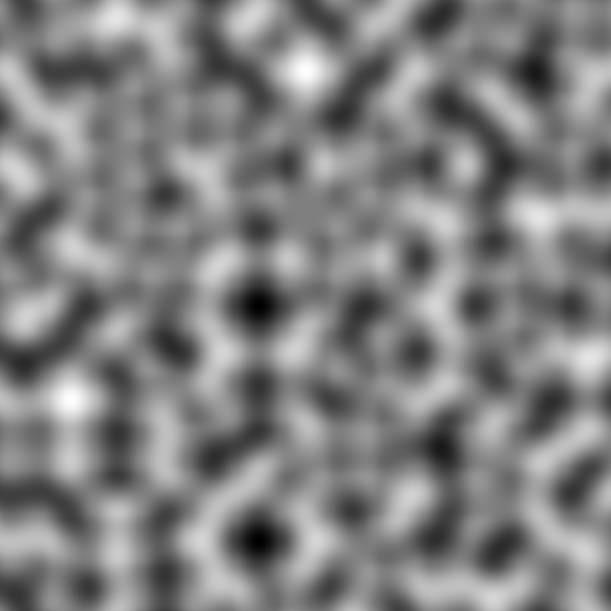</td>
        </tr>
        <tr>
            <td>3D</td>
            <td>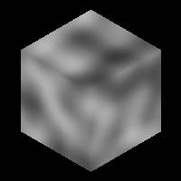</td>
        </tr>
        <tr>
            <td>4D</td>
            <td></td>
        </tr>
        <!-- ridgedmulti -->
        <tr>
            <td rowspan=4>ridgedmulti</td>
            <td>1D</td>
            <td></td>
        </tr>
        <tr>
            <td>2D</td>
            <td>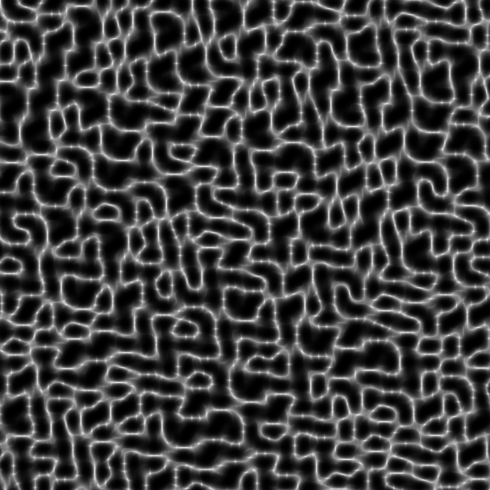</td>
        </tr>
        <tr>
            <td>3D</td>
            <td>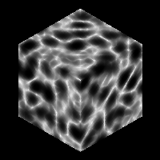</td>
        </tr>
        <tr>
            <td>4D</td>
            <td></td>
        </tr>
        <!-- simplex -->
        <tr>
            <td rowspan=4>simplex</td>
            <td>1D</td>
            <td></td>
        </tr>
        <tr>
            <td>2D</td>
            <td></td>
        </tr>
        <tr>
            <td>3D</td>
            <td>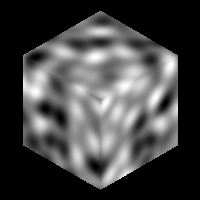</td>
        </tr>
        <tr>
            <td>4D</td>
            <td></td>
        </tr>
        <!-- value -->
        <tr>
            <td rowspan=4>value</td>
            <td>1D</td>
            <td></td>
        </tr>
        <tr>
            <td>2D</td>
            <td></td>
        </tr>
        <tr>
            <td>3D</td>
            <td>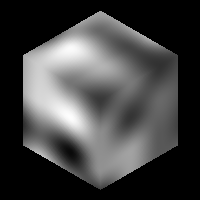</td>
        </tr>
        <tr>
            <td>4D</td>
            <td></td>
        </tr>
        <!-- worley -->
        <tr>
            <td rowspan=4>worley</td>
            <td>1D</td>
            <td></td>
        </tr>
        <tr>
            <td>2D</td>
            <td>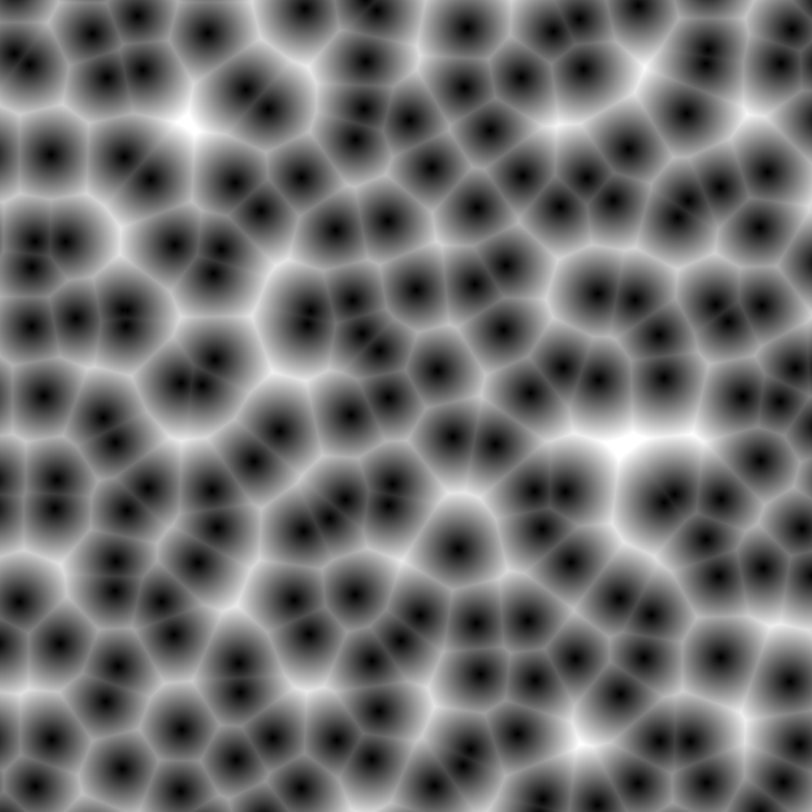</td>
        </tr>
        <tr>
            <td>3D</td>
            <td>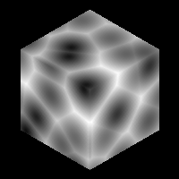</td>
        </tr>
        <tr>
            <td>4D</td>
            <td></td>
        </tr>
    </tbody>
</table>
